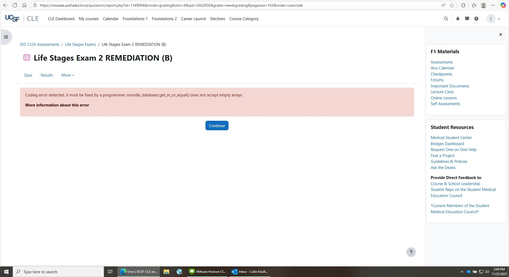

## Initial bug report

- via Slack, from Sebastien (user support)

> Hello, I don't know who this goes to since miriam is out but we received the following ticket -

> "We have several faculty members who have run into the same error message when attempting to grade an exam in the CLE. When clicking into the link(s) below and clicking "Grade" next to one of the ungraded questions, they are getting an error that reads: "Coding error detected, it must be fixed by a programmer: moodle_database::get_in_or_equal() does not accept empty arrays - More information about this error"

### Example courses

- https://courses.ucsf.edu/local/quizanon/report.php?id=1149094&mode=grading 
- https://courses.ucsf.edu/mod/quiz/report.php?id=1135145&mode=grading 

### Screenshot



### Status

- [ ] stack trace
- [ ] reproducible

## First attempt at AI prompt

- Claude Code (Sonnet 4.5) 
- Zero-shot
- No thinking or extended thinking used


### Prompt

```
review the codebase and help me determine under what situations will the exception on line 782 of the ile lib/dml/moodile_databse.php will be thrown in cases where grading will be done. here is a message from a user experiencing the problem: We have several faculty members who have run into the same error message when attempting to grade an exam in the CLE. When clicking into the link(s) below and clicking "Grade" next to one of the ungraded questions, they are getting an error that reads: "Coding error detected, it must be fixed by a programmer: moodle_database::get_in_or_equal() does not accept empty arrays - More information about this error" 
```

### Output

```
Based on my investigation of the codebase, I've identified the root cause of the "empty arrays" exception that faculty are experiencing when grading
  quiz questions.

  The Exception

  The error occurs at lib/dml/moodle_database.php:782 where the code throws:
  throw new coding_exception('moodle_database::get_in_or_equal() does not accept empty arrays');

  This happens when an empty array is passed to get_in_or_equal() without the $onemptyitems parameter set to handle the empty array case.

  Root Cause in Grading Context

  The issue occurs in the grading workflow through this call chain:

  1. mod/quiz/report/grading/report.php:238 - When loading attempts by usage IDs:
  list($asql, $params) = $DB->get_in_or_equal($qubaids);
  2. mod/quiz/report/grading/report.php:461-462 - Gets usage IDs for questions to grade:
  list($qubaids, $count) = $this->get_usage_ids_where_question_in_state(
      $grade, $slot, $questionid, $order, $page, $pagesize);
  3. question/engine/datalib.php:722-784 (load_questions_usages_where_question_in_state) - This method can return an empty array of $qubaids when:
    - No attempts match the filtering criteria
    - The current page is beyond available attempts
    - All attempts for a question have already been graded but the count shows otherwise (race condition)
  4. mod/quiz/report/grading/report.php:463 - The empty array is then passed to load_attempts_by_usage_ids($qubaids) which calls get_in_or_equal() without
   checking if the array is empty first

  When This Happens During Grading

  The exception is thrown when:

  1. Race Condition: Multiple graders are working simultaneously, and between checking the count of questions needing grading (line 190) and loading the
  actual attempts (line 463), another instructor grades the last remaining attempt
  2. Pagination Issues: The count shows attempts exist, but the specific page requested has no attempts (especially with "random" ordering)
  3. Filter Mismatch: The get_question_state_summary() returns counts that don't match the actual attempts returned by
  get_usage_ids_where_question_in_state() due to database state changes or group/permission filtering differences
  4. Empty Result Set: When all attempts for a question slot have been graded between the initial check and the attempt to load them

  Solutions

  There are two places this should be fixed:

  Option 1 - Fix at the caller level (mod/quiz/report/grading/report.php:463):
  list($qubaids, $count) = $this->get_usage_ids_where_question_in_state(
          $grade, $slot, $questionid, $order, $page, $pagesize);

  // Add check here
  if (empty($qubaids)) {
      redirect($this->list_questions_url(), get_string('alldoneredirecting', 'quiz_grading'));
  }

  $attempts = $this->load_attempts_by_usage_ids($qubaids);

  Option 2 - Fix in load_attempts_by_usage_ids (mod/quiz/report/grading/report.php:238):
  protected function load_attempts_by_usage_ids($qubaids) {
      global $DB;

      // Handle empty array case
      if (empty($qubaids)) {
          return [];
      }

      list($asql, $params) = $DB->get_in_or_equal($qubaids);
      // ... rest of the method
  }

  Recommended Approach: Implement both fixes for defense in depth, as this protects against the issue at multiple levels and makes the code more robust.

⏺ The issue occurs when there's a timing problem between checking if questions need grading and actually loading the attempts. The most likely scenario
  is:

  1. Faculty clicks "Grade" for a question that shows it has ungraded attempts
  2. The system checks and confirms there are attempts to grade (line 190: if (!$counts || $counts->$grade == 0))
  3. Between this check and loading the attempts, another grader finishes grading the same attempts OR the attempts no longer match the filter criteria
  4. When load_attempts_by_usage_ids() is called with an empty array, it tries to call get_in_or_equal([]) which throws the exception

  This is essentially a race condition or stale data issue common in multi-user grading scenarios.
```

### Review

- **Root causes:** items 1. and 2. are _almost_ on point. Claude doesn't know about our custom grading plugin.
- **Analysis:** Race condition, Pagination issue, Filter mismatch - all nonsense. Empty result set is on point.
- **Proposed solutions:** completely missing the point.

### Status

- [ ] stack trace
- [ ] reproducible

### We get a stack trace!

```
Got error 'PHP message: Default exception handler: Coding error detected, it must be fixed by a programmer: moodle_database::get_in_or_equal() does not accept empty arrays Debug:
 Error code: codingerror
 * line 782 of /lib/dml/moodle_database.php: core\\exception\\coding_exception thrown
 * line 238 of /mod/quiz/report/grading/report.php: call to moodle_database->get_in_or_equal()
 * line 229 of /local/quizanon/report/grading/report.php: call to quiz_grading_report->load_attempts_by_usage_ids()
 * line 167 of /local/quizanon/report/grading/report.php: call to quizanon_grading_report->display_grading_interface()
 * line 94 of /local/quizanon/report.php: call to quizanon_grading_report->display()
 ', referer: https://moodle4-stage.ucsf.edu/local/quizanon/report.php?id=1149094&mode=grading&order=usercode 
```

### Status

- [x] stack trace
- [ ] reproducible


## Second Attempt at AI Prompt

- Codex (GPT-5)
- Zero-shot prompt

### Prompt

Same prompt used with Claude Code; No stack trace provided to the model.

### Output

```
• Manual Grading Error

  - lib/dml/moodle_database.php:782 throws coding_exception('...does not accept empty arrays') whenever moodle_database::get_in_or_equal() is invoked with an empty $items. During manual grading this happens inside mod/quiz/report/grading/report.php:235-276, where load_attempts_by_usage_ids() unconditionallycalls $DB->get_in_or_equal($qubaids) to hydrate the quiz attempts that match the current question and state filter.

  - The grade UI builds $qubaids in two places: (1) on page load via get_usage_ids_where_question_in_state() (mod/quiz/report/grading/report.php:461-489,650-693) and (2) on form submission via the hidden qubaids field processed in process_submitted_data() (mod/quiz/report/grading/report.php:534-578). If either path produces an empty list—because no attempts satisfy the selected filters, the user is in a group with zero participants, or the hidden field arrives blank—the call to load_attempts_by_usage_ids() passes an empty array and triggers the line‑782 exception before the page can render.

  - Your customised grading report at local/quizanon/report/grading/report.php:247-284 introduces another, more likely, way to reach the
    exception. When graders sort by the anonymous "usercode" option, the override adds an inner join on {local_quizanon_usercodes} (local/
    quizanon/report/grading/report.php:271-278). Any attempt whose user does not yet have a record in that table is filtered out, so
    $dm->load_questions_usages_where_question_in_state() returns an empty $qubaids array even though the summary counts (local/quizanon/report/grading/report.php:176-190) still show ungraded attempts. Faculty who click "Grade" with this sort order therefore hit load_attempts_by_usage_ids() with no IDs and immediately get the "does not accept empty arrays" error.

  - Less commonly, a similar empty list can surface if another grader finishes the outstanding attempts between the time the list view is rendered and the time a user opens the grading page. In that race the second grader's request still contains grade=needsgrading, but by the time get_usage_ids_where_question_in_state() runs there are zero matches, and the same exception is raised.

Next steps: ensure anonymous codes exist before enabling the "usercode" sort (e.g., seed local_quizanon_usercodes via local_anonquiz_get_usercode()), or guard load_attempts_by_usage_ids() against empty input so it can redirect back to the list instead of calling $DB->get_in_or_equal() with an empty array.
```

### Review

- Codex analyzes the issue mostly correct, and points out the `INNER JOIN` as the source of failure. 

- Suggested next steps are partially correct. 

### Status

- [x] stack trace
- [ ] reproducible

## Solution

https://github.com/ucsf-education/local_quizanon/pull/31/changes
